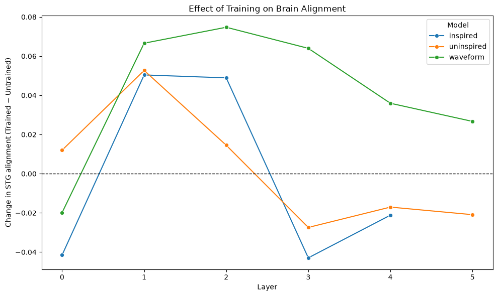
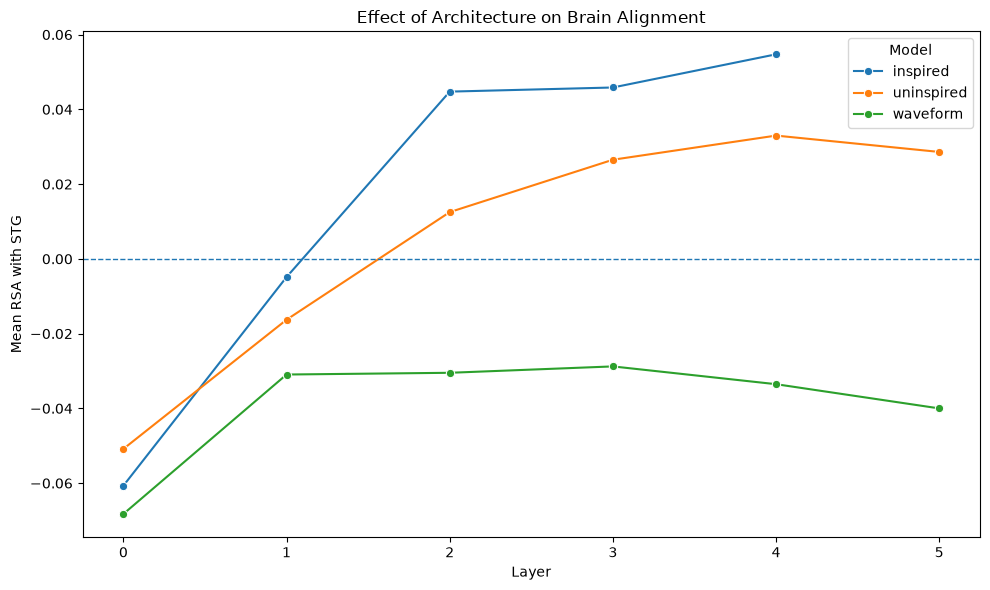
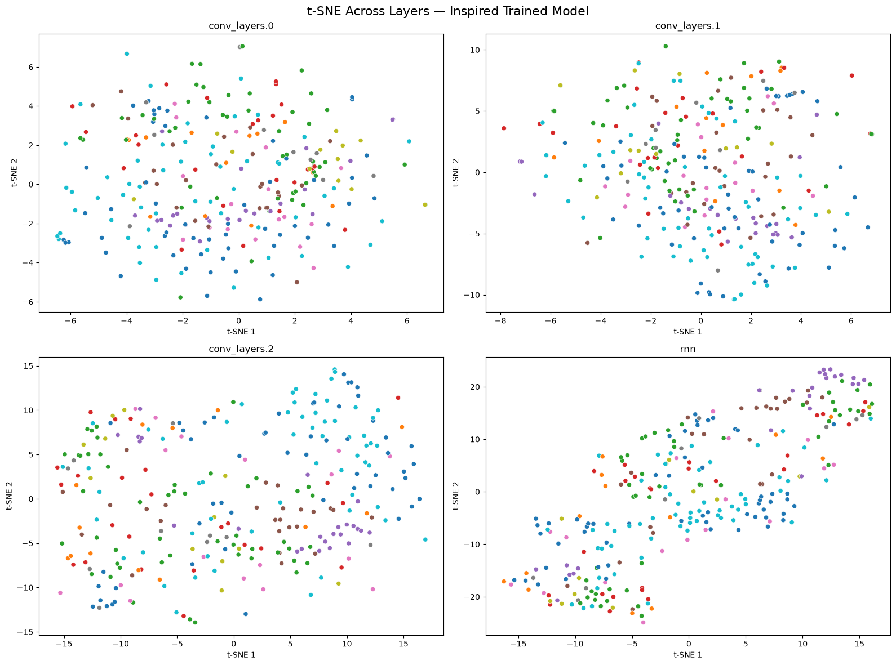
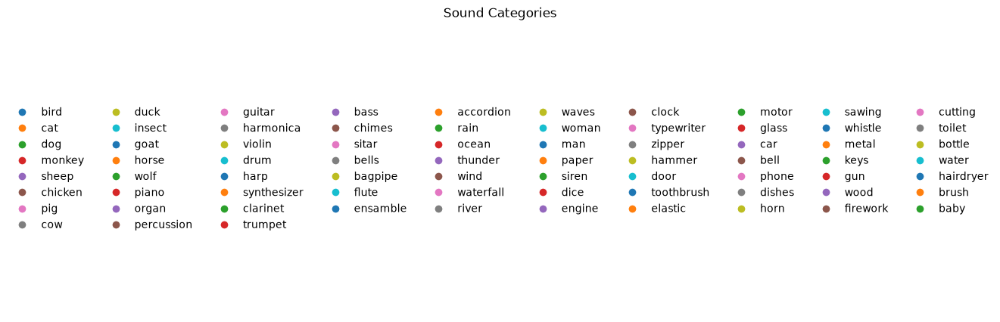

# Setup

To run the notebook create a new virtual environment and install a the requirements.

```
python -m venv .venv
source .venv/bin/activate
python -m pip install -r requirements.txt
```

# Part I : RSA for Model to Brain Analysis
## 1. Model Activations and RDMs

First, we loaded the Santoro dataset and computed the brain RDM. For each model (`waveform`, `uninspired`, `inspired`), the activations were extracted from five layers for both trained and untrained models.
After computing the RDMs for each layer, we compared it to the brain RDM using the Spearman correlation.

We observed the highest correlation for the pretrained YAMNet (0.098), but the overall correlations were small, indicating weak alignment between the model and brain representations.

## 2. Model and Brain Data Comparison

### **Effect of Training** on Brain Alignment

We compared trained and untrained models using **RSA change**, calculated as the mean trained Spearman correlation minus the untrained correlation. A positive value indicates increased alignment with the brain data after training, while a negative value indicates decreased alignment.



The effects of the training varied accross the 3 models.
- `inspired`: remained consistently positive through layer 2, became negative at layer 3
- `uninspired`: remained positive through layer 2, but already started dipping after layer 1
- `waveform`: remained positive throughout all the layers, still the decreasing RSA score accross layers suggest that the brain-model alignment becomes weaker in deeper layers

Overall, based on the relatively small RSA changes we can conlude that training has a modest layer-dependent effect on allignment rather than consistently improving or worsening the allignment.

### **Effect of Architecture** on Brain Alignment

To compare the effect of architectural choices on brain alignment, we compared the trained RSA scores of the inspired, uninspired, and waveform models across layers.



The inspired model showed the highest RSA values, increasing from -0.061 in the first layer to 0.055 in the classifier. uninspired also increased into positive RSA values, reaching 0.033, while waveform remained negative across all layers. This suggests that architectural choices affect brain alignment differently across layers.

### **Layer Depth** and Brain Alignment

We examined how RSA scores change across layers to assess whether different depths of the models align with STG brain data. The `inspired` and `uninspired` models generally showed increasing RSA values in deeper layers, with the `inspired` model reaching the highest alignment. In contrast, `waveform` remained negatively aligned across all layers. 

This suggests that deeper layers in the `inspired` and `uninspired` architectures develop representations that are more similar to the representational structure observed in the STG. However, because the RSA values are generally small, this association should be interpreted cautiously.


## 3. t-SNE Visualization of Model Representations


In the earlier layers, there is substantial overlap between categories, suggesting that their representations are less clearly separated. In deeper layers, the representations become more structured, with several categories forming more distinct groups and less overlap.





# References

*The assignment was completed based on the guidlines and using the provided classes at https://github.com/weidler/ken3170-neuroscience/tree/main/assignment*