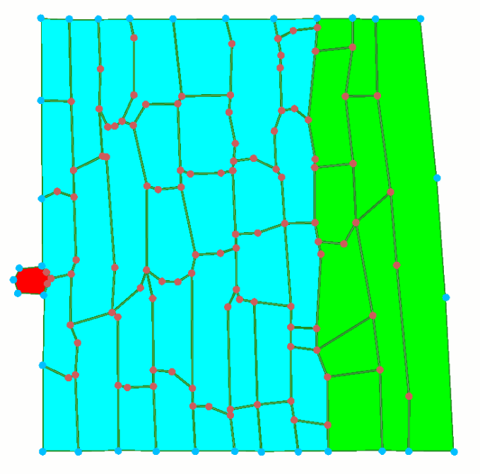
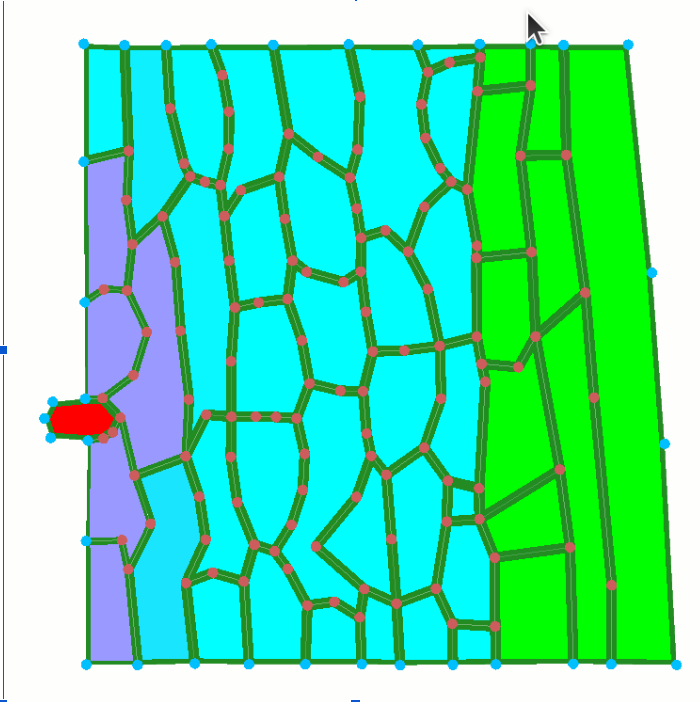
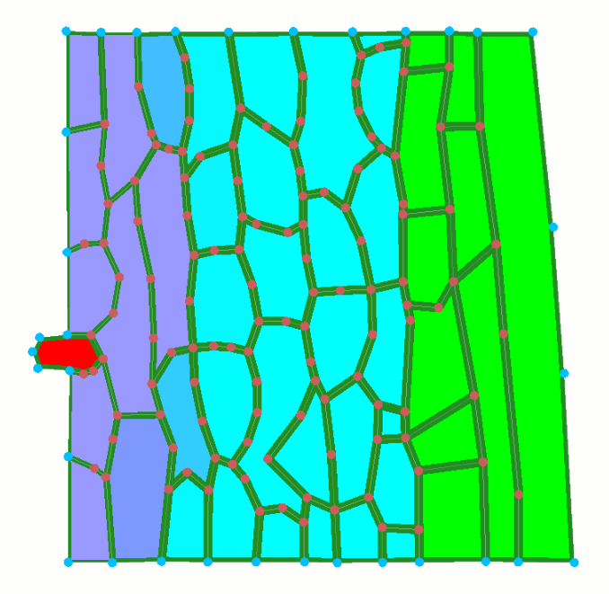
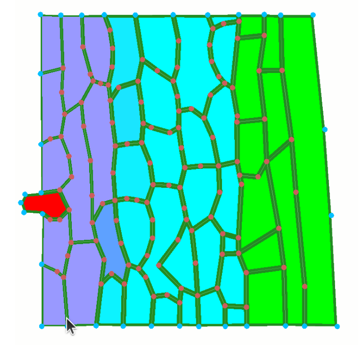
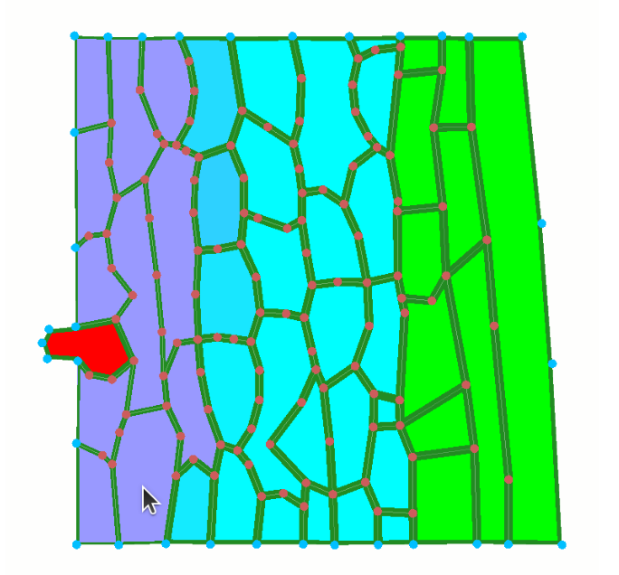
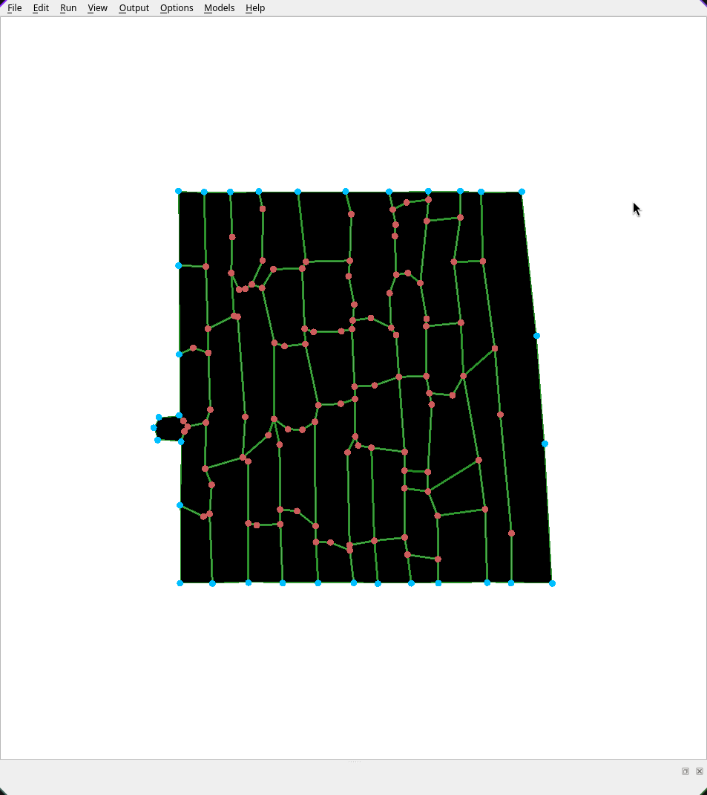
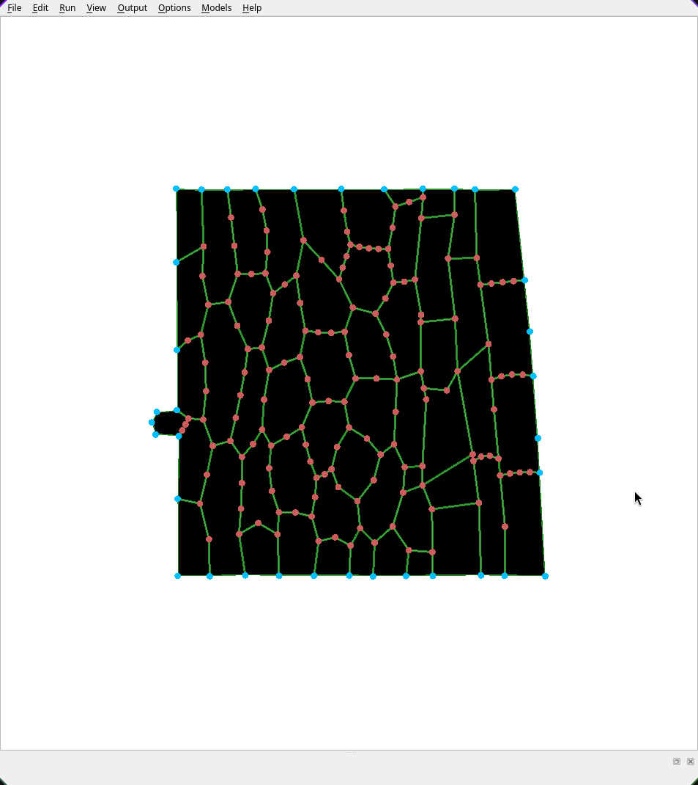
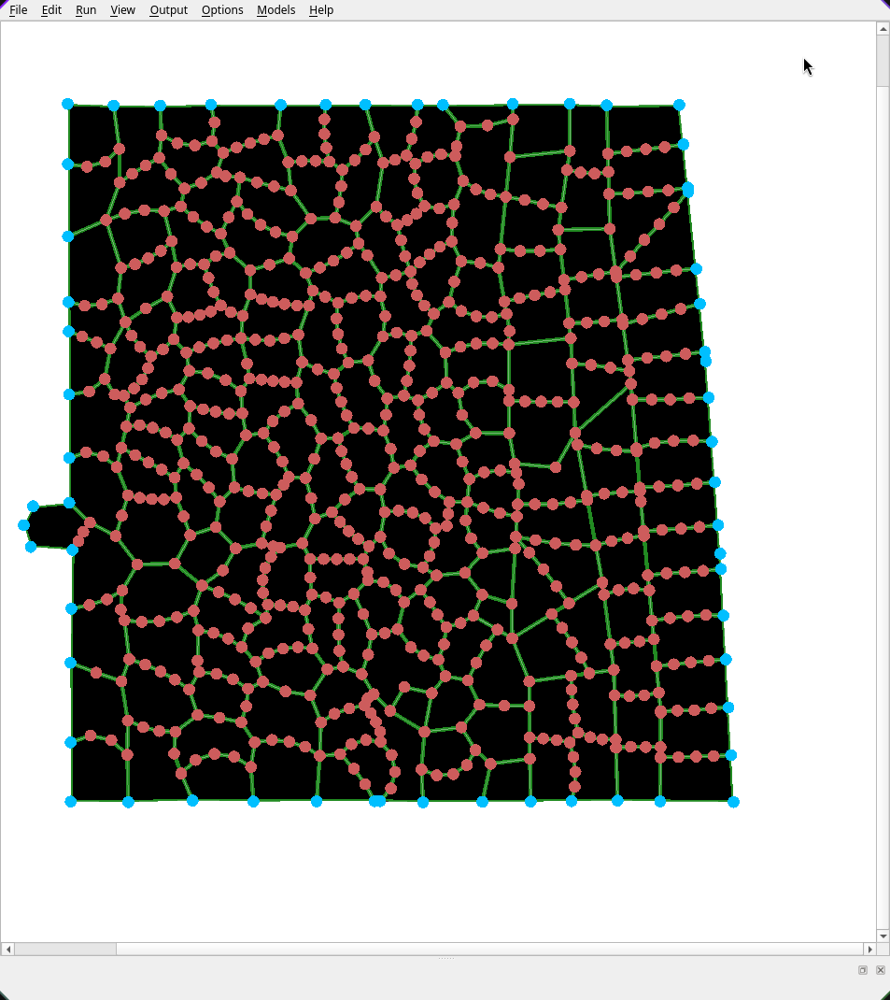
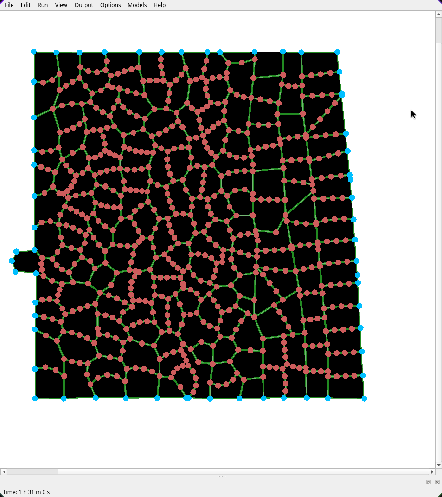

Assignment
# 1. Open pathogen_infection model and run for a duration of 2h. Screenshot initial and every 30 min. Describe how the infected region spreads and how the tissue deforms.


|                 0 min                 |                  30 min                  |                  60 min                  |                  90 min                  |                  120 min                  |
| :--------------------------------------: | :--------------------------------------: | :--------------------------------------: | :--------------------------------------: | :---------------------------------------: |
|  |  |  |  |  |

The cells biome more separated, making the structure less rigid and allowing the infection to penetrate. The infection molds itself to the cells, it does not spread in a perfect circle, but it connects directly to the cell walls. As more time passes, surrounding cells become more affected, and the infection grows. 

# 2. In the model files (Github repo – Models – Infection – infection.cpp9: Read CellHouseKeeping. In your own words: how is a cell's wall stiffness reduced as a function of its chemical level? What does the pathogen do differently?

CellHouseKeeping models the degradation of the cell walls’s stiffness as a linear function of the Chemical(0), scaled by 0.5 for the concentration. This chemical is derived from the pathogen. If the chemical concentration is above 0.1 the wall stiffness drops, the minimum cell wall stiffness is 1.8. This process is what causes the cells to deform, meaning they become less rigid and allow the infection to spread faster. On the other hand, the pathogen behaves differently. It actively grows by increasing its target area and replicates itself using the divide function. It is also immune to the stiffness reduction of the cell walls, since it is explicitly excluded from it in the code. 


# 3. In the model files (Github repo – Models – Infection – infection.cpp9: Read CelltoCellTransport. How is the diffusion coefficient defined? Explain the feedback loop this creates and sketch it: chemical lowers stiffness, lower stiffness raises diffusion, faster diffusion spreads the chemical. Is this positive or negative feedback?

`diffusionCoef = 0.00001 / stiffness` -> lower stiffness produces higher diffusion coeff.

1. Chemical lowers stiffness
2. diffusion coeff. increases
3. chemical spreads faster to neighbours
4. more cells receive the pathogen chemical
5. more walls weaken
6. more spreading -> positive feedback

# 4. Raise and lower rel_cell_div_threshold. How does it change how fast the pathogen population expands? Document two runs.

The relevant code is the following:
`if (c->Area() > par->rel_cell_div_threshold * c->BaseArea()) { c->Divide(); }`

`rel_cell_div_threshold` determines how large a cell has to become relative to its original ('base') area before it divides.

The documented runs and conclusions are summed up in the table below, relative to the base case `rel_cell_div_threshold = 2`.

| Run | Threshold | Observation                                                                 |
| --- | --------: | --------------------------------------------------------------------------- |
| 1   |       Low | More frequent cell division and faster expansion of the infected population |
| 2   |      High | Less frequent division and slower population expansion                      |

## Experiment Results

### High division threshold

|                 0 min                 |                  30 min                  |                  60 min                  |                  90 min                  |                  120 min                  |
| :--------------------------------------: | :--------------------------------------: | :--------------------------------------: | :--------------------------------------: | :---------------------------------------: |
|  |  |  |  |  |

### Low division threshold

|                 0 min                 |                  30 min                 |                  60 min                 |                  90 min                 |                  120 min                 |
| :--------------------------------------: | :-------------------------------------: | :-------------------------------------: | :-------------------------------------: | :--------------------------------------: |
|  |  |  |  |  |


# 5. What is a fundamental difference regarding cell neighbours in this model compared to all other models that you have worked with so far? 
In comparison to the Auxin model the neighboring cells were all plant cells, every cell in the pathogen infection model can be of different type (even the pathogens are considered a cell, and it isnt a plant cell type) so basically we have morethan one cell type (not just plant cell)

# 6. The plant evolves a defense: cells above a chemical threshold stiffen their walls. Describe in pseudocode where in CellHouseKeeping this would go and what sign of feedback it adds. Do not implement it. Pseudocode for the different sections is enough!

The stiffness of the cell walls depends on chemical concentrations of the cell, the higher the concentration is (in accordance to a defense threshold) the more stiff the walls become.

To implement this as code, we go to the `CellHouseKeeping` function and add the following pseudocode to it:

### Pseudocode

```text
def cellHouseKeeping():

    chemical_concentration = get(chemical_concentration)

    if chemical_concentration > defense_threshold:
        Increase cellwall_stiffness  #increase up to maximum stifness
        
    else:
        continute #don't change wall stifness

    continue #continue normal cell house keeping
```

This high stiffness will result in lower diffusion which cause the chemicals to spread more slowly (this causes less chemical to reach neighbouring cells).

This is actually a negative feedback as higher chemical result in lower spread in contrast to the original positive feedback that increased spread as chemicals increased since the walls become less stiff and enabled more diffusion causing cell walls to become weaker.